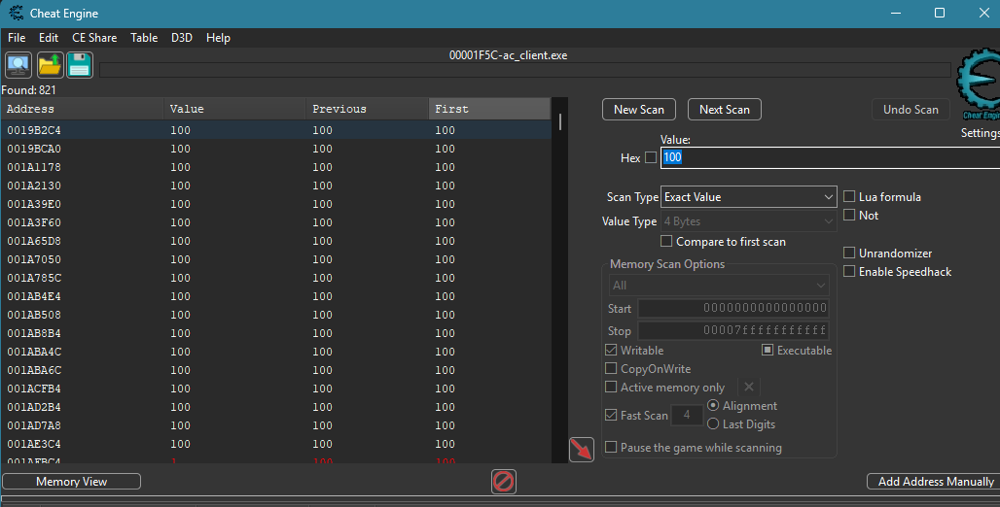
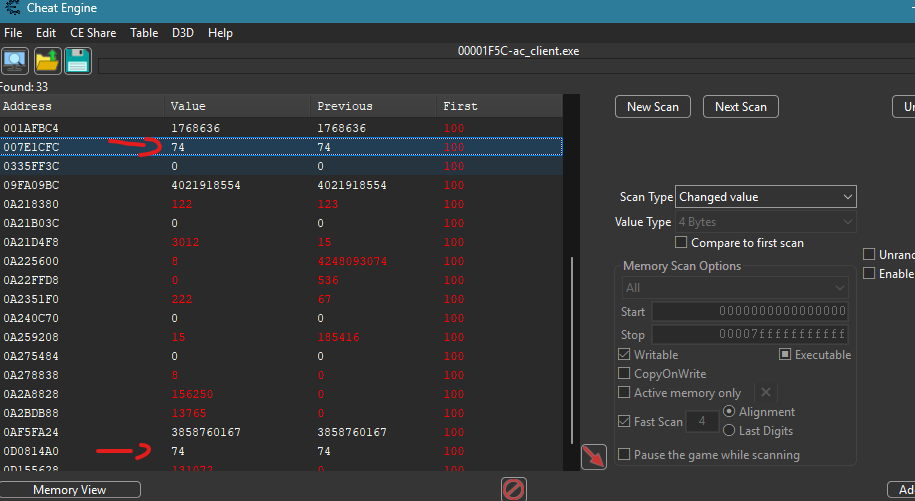
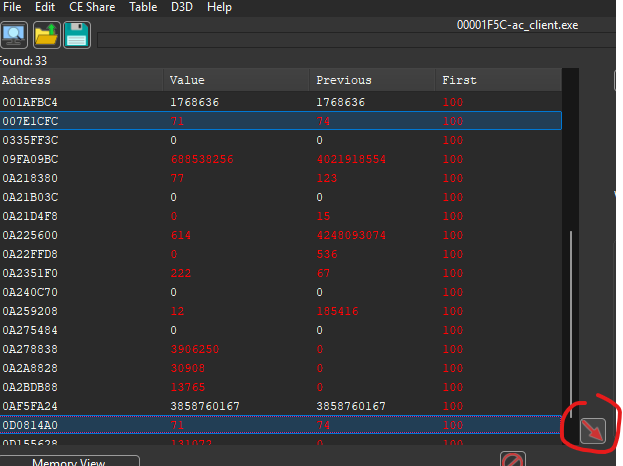
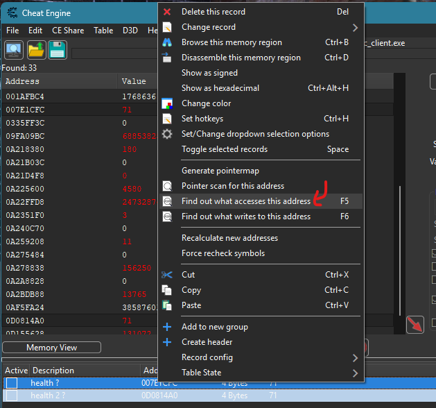
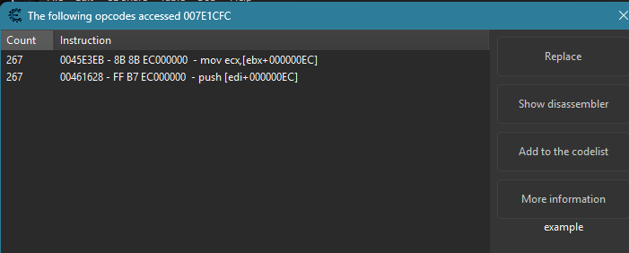
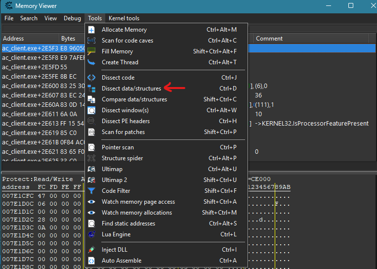
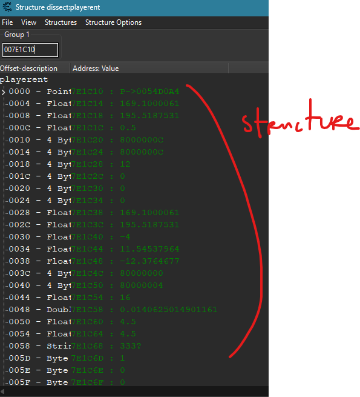
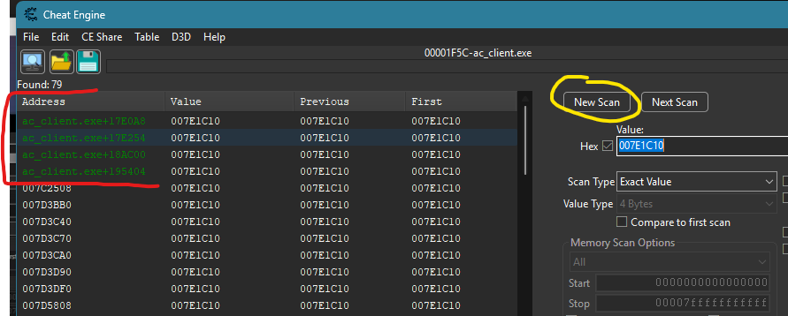
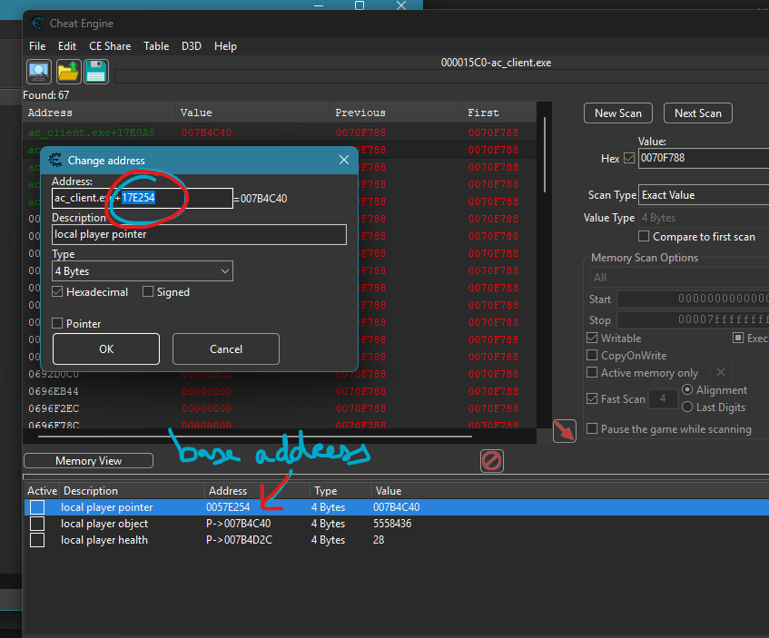
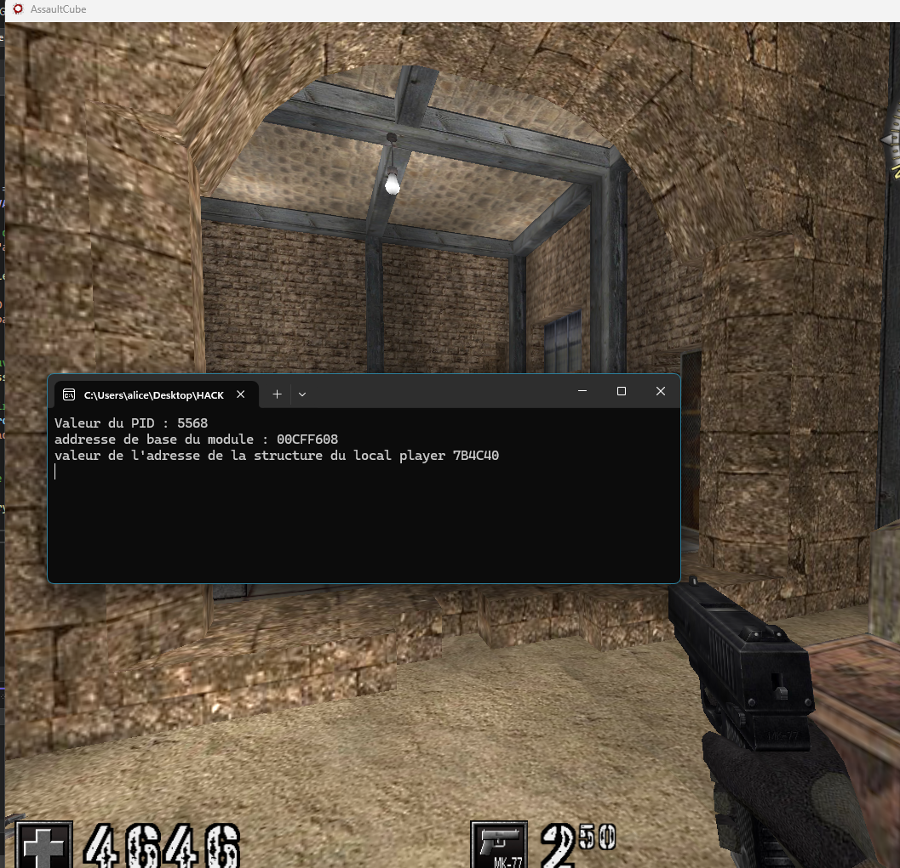

# Assaut Cube – Health Pointer

**Date :** jeudi 27 août 2026

**Source :** How To Write Your First Game Hack in C++ Tutorial (kxbra)

---

But : premier test en game hacking ave cun code externe qui va trouver l'adresse statique de la variable Health et écrire dedans avec `WriteProcessMemory` pour être invincible.

## Méthodologie

**1. Trouver l'adresse dynamique avec Cheat Engine**

- Scanner la valeur de health en jeu
- Perdre de la vie → next scan sur la nouvelle valeur
- Recommencer jusqu'à isoler la bonne adresse
- Cheat Engine la marque en rouge





**2. Trouver ce qui accède à cette adresse**

- Clic droit sur la valeur → "Find out what accesses this address"
- On voit l'instruction : `ebx+0x0EC`
- EBX contient l'adresse de la structure du joueur
- Health se trouve à l'offset `EBX+0xEC`




**3. Trouver le pointeur statique vers la structure**

- Copier la valeur de EBX (ex: `007E1C10`)
- Dissect data/structures dans Memory Viewer pour visualiser la structure du joueur
- Scanner cette adresse en hex → trouver les pointeurs statiques qui pointent dessus
- Prendre un pointeur → l'adresse statique est `0057E254`
- La santé est accessible via `P->007B4D2C`






**4. Adresses finales**

```
Base statique     : baseModule + 0x17E254
Structure joueur  : P->007B4C40
Santé             : P->007B4D2C  (offset +0xEC depuis la structure)
```

---

## Code

**Includes.h**
```c
#pragma once
#include <Windows.h>
#include <TlHelp32.h>
#include <iostream>
#include <stdio.h>
#include <stdlib.h>
#include "proc.h"
#include <tlhelp32.h>
```

**Proc.h**
```c
#pragma once
#include "includes.h"
#include <Windows.h>

//on initialise nos prototypes de fonctions
DWORD GetProcessID(const wchar_t* procName);
DWORD GetModuleBaseAddress(DWORD procId, const wchar_t* modName);
```

**Proc.c**
```c
#include "proc.h"

DWORD GetProcessID(const wchar_t* procName)
{
    DWORD procID = 0;
    HANDLE hSnap = (CreateToolhelp32Snapshot(TH32CS_SNAPPROCESS, 0));
    if (hSnap != INVALID_HANDLE_VALUE) {
        PROCESSENTRY32 procEntry;
        procEntry.dwSize = sizeof(procEntry);
        if (Process32First(hSnap, &procEntry)) {
            do {
                if (!_wcsicmp(procEntry.szExeFile, procName)) {
                    procID = procEntry.th32ProcessID;
                    break;
                }
            } while (Process32Next(hSnap, &procEntry));
        }
    }
    CloseHandle(hSnap);
    return procID;
}

DWORD GetModuleBaseAddress(DWORD procId, const wchar_t* modName)
{
    DWORD modBaseAddr = 0;
    HANDLE hSnap = CreateToolhelp32Snapshot(TH32CS_SNAPMODULE | TH32CS_SNAPMODULE32, procId);
    if (hSnap != INVALID_HANDLE_VALUE) {
        MODULEENTRY32 modEntry;
        modEntry.dwSize = sizeof(modEntry);
        if (Module32First(hSnap, &modEntry)) {
            do {
                if (!_wcsicmp(modEntry.szModule, modName)) {
                    modBaseAddr = (DWORD)modEntry.modBaseAddr;
                    break;
                }
            } while (Module32Next(hSnap, &modEntry));
        }
    }
    CloseHandle(hSnap);
    return modBaseAddr;
}
```

**Main.c**
```c
#include "includes.h"

int main() {

DWORD pID = 0;
DWORD baseModule = 0;
DWORD LocalPlayerPtr = 0; //pointeur sur l'adresse du local player (donc la structure du personnage)
HANDLE hProcess = INVALID_HANDLE_VALUE;
DWORD health = 4646;

//on récupère le pid de notre processus cible
pID = GetProcessID(L"ac_client.exe");
baseModule = GetModuleBaseAddress(pID, L"ac_client.exe");

printf("Valeur du PID : %d\n", pID);
printf("addresse de base du module : %p\n", &baseModule);

//maintenant on va ouvrir le processus cible
hProcess = OpenProcess(PROCESS_ALL_ACCESS, NULL, pID);

//on va lire la mémoire avec ReadProcessMemory
ReadProcessMemory(hProcess, (LPCVOID)(baseModule + 0x17E254), &LocalPlayerPtr, sizeof(LocalPlayerPtr), nullptr);
printf("valeur de l'adresse de la structure du local player %X\n", LocalPlayerPtr);

//maintenant on entre dans une boucle pour écrire dans la mémoire tant que le jeu tourne
while (true) {
    WriteProcessMemory(hProcess, (LPVOID)(LocalPlayerPtr + 0xEC), &health, sizeof(health), nullptr);
}

return 0;
}
```

---

## Résultat

On voit bien le PID du programme, l'adresse de base du processus et l'adresse de la structure qui contient toutes les informations du joueur.
Et surtout on voit bien que la valeur de la santé est statique. On est donc invincible !


